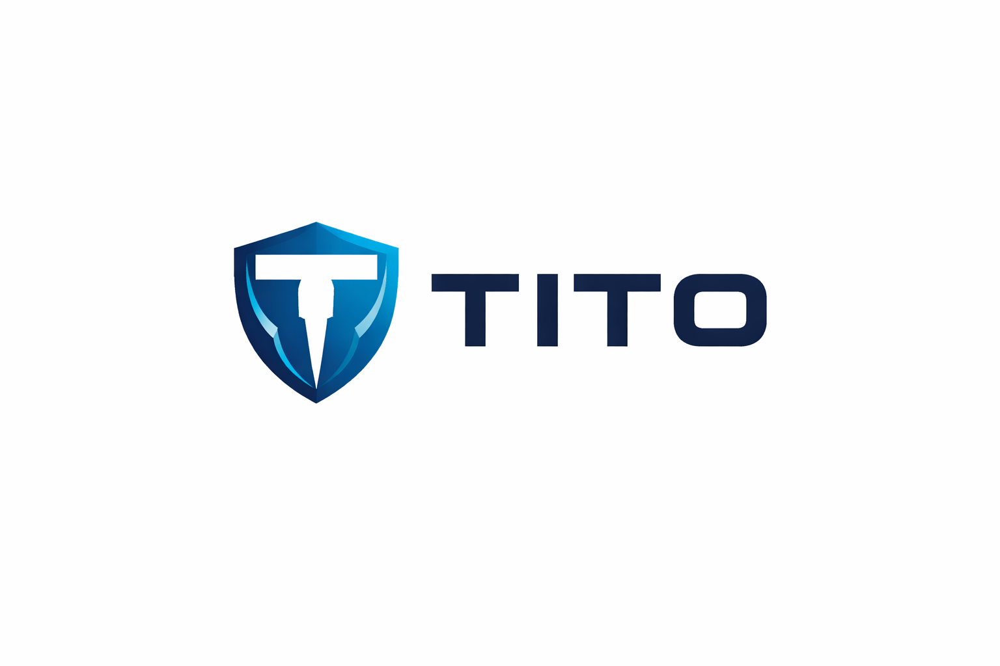
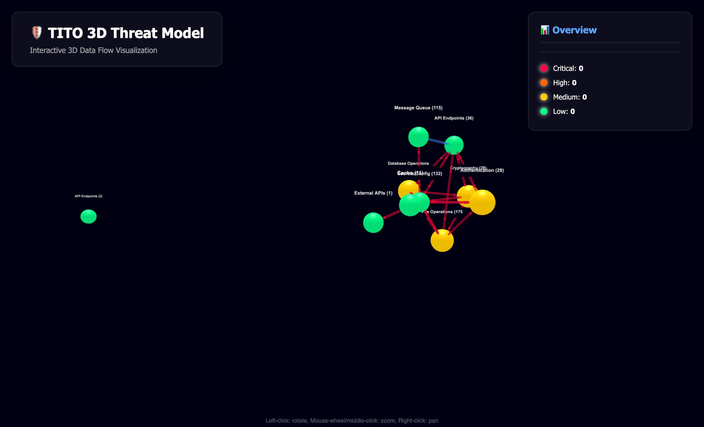
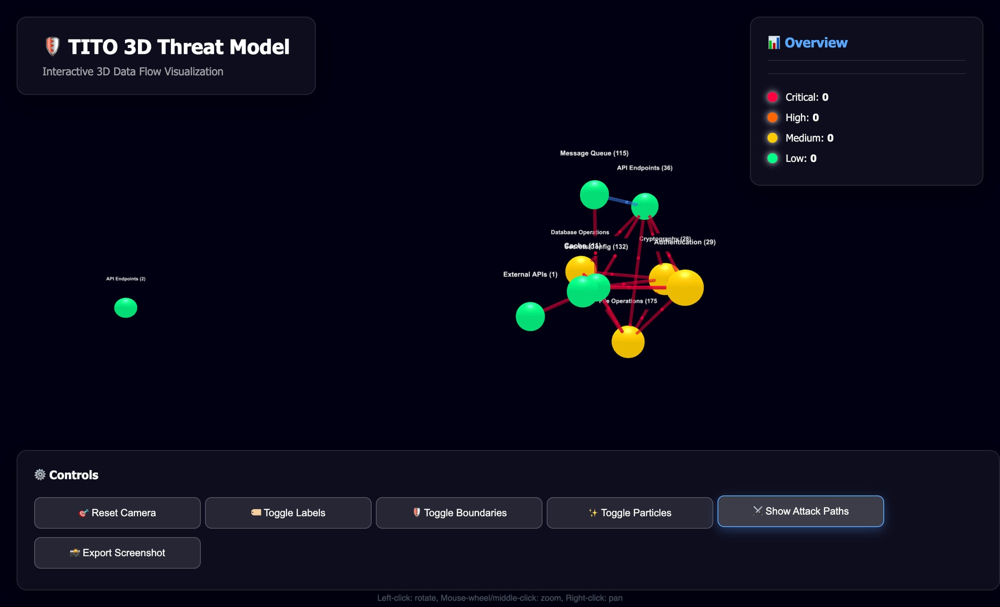

<p align="center">
  
</p>

<h1 align="center">Threat In, Threat Out</h1>

<p align="center"><strong>The threat modeler that thinks like an attacker.</strong></p>

[](https://github.com/Leathal1/TITO/actions/workflows/ci.yml)
[](https://github.com/Leathal1/TITO/releases)
[](https://go.dev)
[](LICENSE)
[](https://github.com/Leathal1/TITO/actions/workflows/tito-scan.yml)
[](https://github.com/marketplace/actions/tito-threat-model)
[](https://ghcr.io/leathal1/tito)
[](https://buymeacoffee.com/stevenleath)

Single binary. Point at a repo. Get **attack path analysis**, **3D threat visualization**, **STRIDE-LM + MAESTRO classification**, and **MITRE ATT&CK mappings** — all in one scan.

<p align="center">
  
</p>

---

## Why TITO?

Every other threat modeling tool makes you draw diagrams by hand. TITO **reads your code** and builds the threat model for you — then chains findings into **realistic multi-step attack paths**.

| Feature | TITO | Microsoft TMT | OWASP Threat Dragon | IriusRisk |
|---------|:----:|:-------------:|:-------------------:|:---------:|
| **STRIDE-LM** | Yes | STRIDE only | STRIDE only | STRIDE only |
| **MAESTRO** (AI/Agent threats) | Yes | No | No | No |
| **Attack Path Analysis** | Yes | No | No | No |
| **3D Visualization** | Yes | No | No | No |
| **SAST Integration** | Yes Semgrep | No | No | Limited |
| **MITRE ATT&CK** | Yes | No | No | Limited |
| **PR Threat Diffing** | Yes | No | No | No |
| **Interactive Data Flow** | Yes D3.js + Three.js | Basic | Basic | Basic |
| **CLI / CI/CD** | Yes Single binary | No GUI only | No Web only | No SaaS |
| **Runs Anywhere** | Yes Mac/Linux/Windows | Windows only | Browser | Cloud |

---

## Quick Start

```bash
# Install
go install github.com/Leathal1/TITO/v2/cmd/tito@latest

# Scan a repository
tito scan --repo https://github.com/your/app

# Full analysis with all frameworks
tito scan \
  --repo https://github.com/your/app \
  --maestro \
  --mitre \
  --attack-paths \
  --3d \
  --output threat-model.html

# Open the interactive 3D visualization
open threat-model.html
```

```
TITO Repository Scanner
==================================================

Cloning repository: https://github.com/your/app

✓ Repository scanned successfully
  Assets discovered: 655
  Data flows: 5205

Analyzing code for security threats...
✓ Total processed threats: 19

Running MAESTRO agentic AI threat analysis...
✓ MAESTRO Classification complete

Enriching with MITRE ATT&CK mappings...
✓ ATT&CK techniques mapped

Results Summary:
--------------------------------------------------
  Critical threats: 8
  High threats: 6
  Medium threats: 3
  Low threats: 2
  Total affected assets: 655
  Data flows analyzed: 5205
```

---

## Features

### Attack Path Analysis

**Like BloodHound, but for application-layer threat models.**

TITO chains individual findings into realistic multi-step attack paths — answering: *"If an attacker lands here, what's the worst-case path to crown jewels?"*

```bash
tito attack-paths --repo . --top 5 --3d --narrative
```

Each path shows:
- **Entry point** → intermediate steps → **crown jewel** (databases, secrets, admin APIs)
- Chained MITRE ATT&CK techniques at each hop
- Cumulative risk score across the kill chain
- Human-readable **narrative** explaining the attack story

Attack paths overlay directly onto the 3D visualization — red glowing trails showing exactly how an attacker would move through your system.

### 3D Threat Visualization

Interactive Three.js visualization with:
- **Color-coded nodes** by risk severity (critical → low)
- **Animated data flows** between components
- **Trust boundaries** as translucent shells
- **Attack path overlays** with glowing particle trails
- **Click any node** for full threat details
- **Dark theme** — designed for presentations
- Export to screenshot

<p align="center">
  
</p>

Also generates **2D interactive diagrams** (D3.js) with the `--dataflow` flag.

### PR Threat Diffing

Run `tito diff` in CI to catch security regressions on every pull request:

```bash
tito diff --repo . --base main --head feature-branch --format markdown
```

Output:
```markdown
## TITO Threat Model Delta

**Risk: INCREASED** (6.2 → 7.8) | Verdict: WARN

### New Threats (2)
- SQL Injection in /api/admin/users [CRITICAL]
- Unauthenticated endpoint exposed [HIGH]
```

Exit codes for CI gates:
- **0** = PASS — no new threats or risk decreased
- **1** = WARN — new threats detected (non-critical)
- **2** = FAIL — critical security regression

See [docs/DIFF.md](docs/DIFF.md) for full documentation.

### STRIDE-LM

Extended STRIDE with **Lateral Movement** and **Malware** categories. Maps threats via keyword analysis, CWE IDs, and MITRE ATT&CK tactics.

| Category | What it Catches |
|----------|----------------|
| **S**poofing | Authentication bypasses, identity issues |
| **T**ampering | Data/code modification, integrity violations |
| **R**epudiation | Missing audit trails, log gaps |
| **I**nfo Disclosure | Data leaks, credential exposure, PII |
| **D**enial of Service | Resource exhaustion, crash vectors |
| **E**levation of Privilege | Authz bypasses, privilege escalation |
| **L**ateral Movement | Internal pivoting, trust exploitation |
| **M**alware | Supply chain attacks, code injection |

### MAESTRO (Agentic AI Security)

Cloud Security Alliance's 7-layer framework for AI agent threat modeling — the only CLI tool that implements it:

| Layer | Focus |
|-------|-------|
| 1. Foundation Models | Prompt injection, jailbreaking, model theft |
| 2. Data & Knowledge | RAG poisoning, embedding attacks |
| 3. Agent Frameworks | LangChain/CrewAI exploits, memory manipulation |
| 4. Tooling & Integration | MCP attacks, API abuse, tool poisoning |
| 5. Agent Communication | Trust exploitation, message spoofing |
| 6. Deployment & Infra | Container escapes, sandbox bypasses |
| 7. Ecosystem & Governance | Compliance gaps, accountability |

### Semgrep + MITRE ATT&CK

- Runs **Semgrep** static analysis and maps findings to STRIDE-LM categories via CWE mappings
- Every finding enriched with relevant **ATT&CK techniques** across all 12 tactics
- Enable with `--semgrep` and `--mitre` flags

---

## Real World: JoonaPay Fintech Audit

TITO scanned a production fintech payments platform:

| Metric | Result |
|--------|--------|
| **Assets discovered** | 655 |
| **Data flows mapped** | 5,205 |
| **Threats identified** | 19 |
| **Critical severity** | 8 |
| **High severity** | 6 |
| **Attack paths found** | 10 |
| **Scan time** | ~45 seconds |

Key findings included hardcoded credentials, unauthenticated payment APIs, and a 4-hop attack path from a public endpoint through message queues to the payment database.

**Zero manual diagram drawing. Zero configuration files. Just `tito scan`.**

---

## Features

- Repository scanning & asset discovery
- STRIDE-LM threat classification
- MAESTRO agentic AI analysis
- MITRE ATT&CK technique mapping
- PCI DSS v4.0 compliance mapping
- Application architecture detection
- Attack path analysis with narratives
- 2D & 3D data flow visualization
- PR threat diffing
- Semgrep integration
- Compliance frameworks (PCI DSS, SOC 2, ISO 27001, NIST 800-53, HIPAA)
- SARIF output for GitHub Security tab

---

## CI/CD Integration

TITO integrates with every major CI/CD platform. Pick the method that fits your workflow:

### GitHub Actions — Marketplace Action

The simplest integration. Add to any workflow:

```yaml
- uses: Leathal1/TITO@v2
  with:
    maestro: true
    mitre: true
    sarif-output: true
    fail-on: critical
```

<details>
<summary><b>Full workflow example with PR comments</b></summary>

```yaml
name: TITO Threat Model
on:
  pull_request:
    branches: [main]

jobs:
  threat-check:
    runs-on: ubuntu-latest
    steps:
      - uses: actions/checkout@v4
        with:
          fetch-depth: 0

      - uses: Leathal1/TITO@v2
        id: tito
        with:
          maestro: true
          mitre: true
          attack-paths: true
          sarif-output: true
          fail-on: critical

      - name: Comment on PR
        if: always() && github.event_name == 'pull_request'
        uses: actions/github-script@v7
        with:
          script: |
            const total = '${{ steps.tito.outputs.threats-total }}';
            const critical = '${{ steps.tito.outputs.threats-critical }}';
            const high = '${{ steps.tito.outputs.threats-high }}';
            const badge = '${{ steps.tito.outputs.badge-url }}';
            const body = `## 🛡️ TITO Threat Model\n\n\n\n| Severity | Count |\n|---|---|\n| Critical | ${critical} |\n| High | ${high} |\n| **Total** | **${total}** |`;
            github.rest.issues.createComment({
              issue_number: context.issue.number,
              owner: context.repo.owner,
              repo: context.repo.repo,
              body: body
            });

      - uses: actions/upload-artifact@v4
        with:
          name: threat-model
          path: threat-model.html
```

</details>

### GitHub Actions — Reusable Workflow

Call from any repository without copying workflow files:

```yaml
jobs:
  threat-model:
    uses: Leathal1/TITO/.github/workflows/tito-reusable.yml@main
    with:
      maestro: true
      mitre: true
      sarif-output: true
      fail-on: critical
```

### GitHub Actions — Docker (Fastest)

Skip Go compilation entirely:

```yaml
- uses: Leathal1/TITO/.github/actions/docker@v2
  with:
    maestro: true
    mitre: true
```

### GitHub Actions — PR Threat Diff

Catch security regressions on every pull request:

```yaml
name: TITO PR Check
on:
  pull_request:
    branches: [main]

jobs:
  threat-diff:
    runs-on: ubuntu-latest
    steps:
      - uses: actions/checkout@v4
        with:
          fetch-depth: 0

      - uses: Leathal1/TITO@v2
        with:
          diff-base: ${{ github.base_ref }}
          diff-head: ${{ github.head_ref }}
          fail-on: critical
```

### GitLab CI

```yaml
include:
  - project: 'Leathal1/TITO'
    file: '.gitlab/tito-scan.gitlab-ci.yml'
    ref: main
```

See [GITLAB_CI.md](GITLAB_CI.md) for full documentation including MR diff templates.

### Docker (Any CI)

```bash
docker run --rm -v "$(pwd):/workspace" ghcr.io/leathal1/tito:latest \
  scan --repo /workspace --maestro --mitre --attack-paths --output /workspace/report.html
```

### Pre-commit Hook

```yaml
# .pre-commit-config.yaml
repos:
  - repo: https://github.com/Leathal1/TITO
    rev: v2.1.0
    hooks:
      - id: tito-scan
```

Or install manually: `cp scripts/pre-commit-tito.sh .git/hooks/pre-commit`

See [INSTALL.md](INSTALL.md) for setup details.

---

## Badges

Add a TITO threat model badge to your README:

```markdown
[](https://github.com/Leathal1/TITO)
```

Generate a dynamic badge from scan results:

```bash
# After running a scan with --save
./scripts/generate-badge.sh threatmodel.json
```

In GitHub Actions, the badge URL is available as the `badge-url` output:

```yaml
- uses: Leathal1/TITO@v2
  id: tito
  with:
    maestro: true

# Badge URL: ${{ steps.tito.outputs.badge-url }}
```

---

## Build from Source

```bash
git clone https://github.com/Leathal1/TITO.git
cd TITO
make build          # Build for current platform
make test           # Run all tests
make lint           # Run golangci-lint + go vet
make cross-compile  # Build for all platforms
make release        # Build + checksums
make docker-build   # Build Docker image
make help           # Show all targets
```

## Architecture

```
TITO Pipeline:
┌──────────┐   ┌───────────┐   ┌──────────┐   ┌───────────┐   ┌─────────────┐
│ Scan Repo │──▶│ Classify  │──▶│  Enrich  │──▶│  Analyze  │──▶│  Visualize  │
│           │   │           │   │          │   │           │   │             │
│ • Assets  │   │ • STRIDE  │   │ • ATT&CK │   │ • Attack  │   │ • 3D/Three  │
│ • Flows   │   │ • MAESTRO │   │ • Semgrep│   │   Paths   │   │ • 2D/D3.js  │
│ • Deps    │   │ • NVD/CVE │   │ • CWE    │   │ • Chains  │   │ • Reports   │
└──────────┘   └───────────┘   └──────────┘   └───────────┘   └─────────────┘
```

## All Commands

```
tito scan           Scan a repository for threats and assets
tito attack-paths   Generate attack path analysis and kill chain visualization
tito diff           Compare threat models between two scans (PR diff)
tito report         Generate threat report from scan results
tito serve          Serve a TITO report or diagram in the browser
tito status         Show TITO system status
tito semgrep        Manage Semgrep dependency (status/install/uninstall)
tito dashboard      Start the web dashboard
tito api            Start the TITO API server
tito compliance     Map threats to compliance frameworks (PCI DSS, SOC 2, ISO 27001, NIST, HIPAA)
```

## TITO Pro

Want advanced features? **TITO Pro** adds:

| Feature | Description |
|---------|-------------|
| `tito drift` | Security drift detection — track posture changes over time |
| `tito sbom` | SBOM → Threat Model — import CycloneDX/SPDX, generate threats |
| `tito fix` | Auto-remediation — PR-ready code patches for threats |
| `tito org` | Multi-repo org scan — cross-service attack path analysis |
| `--exec-summary` | LLM executive summaries — board-ready reports via GPT-4/Claude |

**Pricing:** Pro $49/mo · Team $29/user/mo · Enterprise custom

Coming soon — [join the waitlist](https://buymeacoffee.com/stevenleath) to get notified.

---

## Support

If TITO saves you time, consider buying me a coffee:

[](https://buymeacoffee.com/stevenleath)

## Contributing

PRs welcome. Run `make test && make lint` before submitting.

## License

MIT

---

<p align="center">
  <i>Built by <a href="https://x.com/gorillainfosec">@gorillainfosec</a> — "The best defense is built by those who truly understand offense."</i>
</p>
