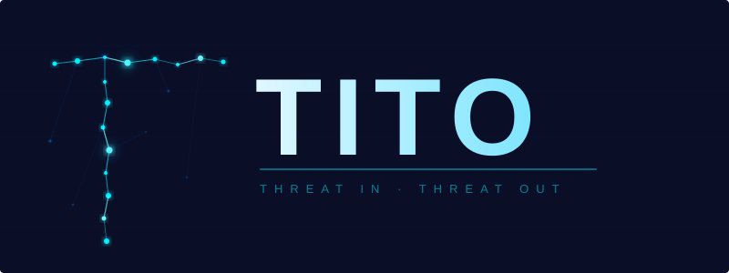

<p align="center">
  
</p>

<p align="center"><strong>Automated threat modeling for modern development teams.</strong></p>

<p align="center">
  <a href="https://github.com/Leathal1/TITO/actions/workflows/ci.yml"></a>
  <a href="https://github.com/Leathal1/TITO/releases"></a>
  <a href="https://github.com/Leathal1/TITO/blob/main/LICENSE"></a>
  <a href="https://github.com/marketplace/actions/tito-threat-model"></a>
  <a href="https://ghcr.io/leathal1/tito"></a>
</p>

---

## What is TITO?

**TITO** (Threat In, Threat Out) is a single Go binary that reads your code and builds a complete threat model — no diagrams to draw, no configuration files to write.

```bash
# Scan any repo
tito scan --repo https://github.com/your/app --maestro --mitre --3d --output threat-model.html

# Open the interactive 3D visualization
open threat-model.html
```

**What you get:**
- Assets and data flows discovered automatically from your code
- STRIDE-LM + MAESTRO threat classification (including AI/agent threats)
- MITRE ATT&CK technique mapping
- Attack path analysis with kill chain narratives
- Interactive 3D & 2D visualizations — presentation-ready

| TITO | Microsoft TMT | OWASP Threat Dragon | IriusRisk |
|------|:-------------:|:-------------------:|:---------:|
| **STRIDE-LM** (extended) | STRIDE only | STRIDE only | STRIDE only |
| **MAESTRO** AI/Agent threats | ❌ | ❌ | ❌ |
| **Attack paths** | ❌ | ❌ | ❌ |
| **3D visualization** | ❌ | ❌ | ❌ |
| **SAST integration** | ❌ | ❌ | Limited |
| **MITRE ATT&CK** | ❌ | ❌ | Limited |
| **PR threat diffing** | ❌ | ❌ | ❌ |
| **CLI / CI/CD native** | GUI only | Web only | SaaS |
| **Single binary, zero deps** | Windows only | ❌ | ❌ |
| **Price** | **Free (OSS, MIT)** | Free | Free | $$$$ |

---

## TITO Free vs TITO Pro

| Feature | TITO Free | TITO Pro |
|---------|:---------:|:--------:|
| STRIDE-LM classification | ✅ | ✅ |
| MAESTRO AI agent analysis | ✅ | ✅ |
| MITRE ATT&CK mapping | ✅ | ✅ |
| Attack path analysis | ✅ | ✅ |
| 3D & 2D visualization | ✅ | ✅ |
| Semgrep SAST integration | ✅ | ✅ |
| PCI DSS compliance mapping | ✅ | ✅ |
| PR threat diffing | ✅ | ✅ |
| GitHub Action + GitLab CI | ✅ | ✅ |
| **Multi-repo org scanning** | ❌ | ✅ |
| **Cross-service attack paths** | ❌ | ✅ |
| **Security drift detection** | ❌ | ✅ |
| **SBOM → threat model** | ❌ | ✅ |
| **Auto-remediation (PR-ready patches)** | ❌ | ✅ |
| **LLM executive summaries** | ❌ | ✅ |
| **Live CVE/NVD intelligence** | ❌ | ✅ |

**[Try TITO Pro free for 14 days →](https://tito.security/pro)** (no credit card required)

```bash
# Activate your trial
tito-pro activate --trial

# Then use Pro features:
tito-pro org scan --org your-org --maestro        # Multi-repo scanning
tito-pro drift --baseline main --current feature   # Security drift detection
tito-pro sbom import sbom.json --enrich-cve        # SBOM → threat model
tito-pro fix --threat TH-001                       # Auto-remediation
```

TITO Free is MIT licensed — all core features ship in the single binary, no gates, no license keys. TITO Pro adds the operational layer: continuous monitoring, organizational visibility, and executive reporting.

---

## Quick Start

```bash
# Option 1: Go install
go install github.com/Leathal1/TITO/v2/cmd/tito@latest

# Option 2: Docker
docker run --rm -v "$(pwd):/workspace" ghcr.io/leathal1/tito:latest scan --repo /workspace --maestro --output /workspace/report.html

# Option 3: Download a binary
# Grab the latest release for your platform from:
# https://github.com/Leathal1/TITO/releases
```

**First scan:**

```bash
tito scan --repo https://github.com/your/app --maestro --mitre --attack-paths --3d --output threat-model.html
```

**Open the output —** `threat-model.html` in any browser.

---

## AI Agent Security (MAESTRO Framework)

TITO is the **only CLI tool** implementing Cloud Security Alliance's MAESTRO framework for agentic AI threat modeling.

| Layer | Threat Examples |
|-------|-----------------|
| **1. Foundation Models** | Prompt injection, jailbreaking, model extraction |
| **2. Data & Knowledge** | RAG poisoning, embedding attacks |
| **3. Agent Frameworks** | LangChain/CrewAI exploits, memory corruption |
| **4. Tooling & Integration** | MCP server attacks, tool poisoning |
| **5. Agent Communication** | Trust boundary violations, message spoofing |
| **6. Deployment & Infrastructure** | Container escapes, sandbox bypasses |
| **7. Ecosystem & Governance** | Compliance gaps, liability exposure |

Enable with `--maestro`. As AI agents ship to production with tool access (code execution, DB queries, web browsing), traditional threat models miss entire attack classes.

---

## Features

### Attack Path Analysis (like BloodHound for app-layer)

```bash
tito attack-paths --repo . --top 5 --3d --narrative
```

Chains individual findings into multi-step attack paths — each shows entry point → intermediate steps → crown jewel, with MITRE ATT&CK techniques at every hop and a human-readable narrative.

### 3D Threat Visualization

Interactive Three.js visualization with PBR materials, atmospheric depth, refined colors, and responsive controls:

- Color-coded nodes by risk severity (critical → low)
- Animated data flows with particle trails
- Trust boundaries as translucent shells
- Attack path overlays with path highlighting
- Click any node for full threat details
- Responsive — works on desktop, tablet, and mobile
- Keyboard shortcuts: R (reset), L (labels), B (boundaries), P (particles), A (attack paths)

### PR Threat Diffing

```bash
tito diff --repo . --base main --head feature-branch --format markdown
```

| Exit Code | Meaning |
|:---------:|---------|
| **0** | PASS — no new threats or risk decreased |
| **1** | WARN — new non-critical threats |
| **2** | FAIL — critical security regression |

### Semgrep + MITRE ATT&CK

Runs Semgrep static analysis and maps findings to STRIDE-LM categories via CWE. Every finding enriched with relevant ATT&CK techniques.

### All Commands

```
tito scan           Scan a repository for threats and assets
tito attack-paths   Generate attack path analysis
tito diff           Compare threat models (PR diff)
tito report         Generate threat report from scan results
tito dashboard      Launch web dashboard
tito compliance     Map threats to compliance frameworks
tito status         Show system status
```

---

## CI/CD Integration

### GitHub Actions

The simplest integration. Add to any workflow:

```yaml
- uses: Leathal1/TITO@v2
  with:
    maestro: true
    mitre: true
    sarif-output: true
    fail-on: critical
```

Also supports reusable workflows, Docker action, and PR threat diff workflows — see the [full docs](https://github.com/Leathal1/TITO#cicd-integration).

### Docker (Any CI)

```bash
docker run --rm -v "$(pwd):/workspace" ghcr.io/leathal1/tito:latest \
  scan --repo /workspace --maestro --mitre --output /workspace/report.html
```

### GitLab CI

```yaml
include:
  - project: 'Leathal1/TITO'
    file: '.gitlab/tito-scan.gitlab-ci.yml'
    ref: main
```

---

## Build from Source

```bash
git clone https://github.com/Leathal1/TITO.git
cd TITO
make build          # Build for current platform
make test           # Run all tests
make lint           # Run golangci-lint + go vet
make cross-compile  # Build for all platforms
make release        # Build + checksums
make docker-build   # Build Docker image
make help           # Show all targets
```

---

## Architecture

```
TITO Pipeline:
┌──────────┐   ┌───────────┐   ┌──────────┐   ┌───────────┐   ┌─────────────┐
│ Scan Repo │──▶│ Classify  │──▶│  Enrich  │──▶│  Analyze  │──▶│  Visualize  │
│           │   │           │   │          │   │           │   │             │
│ • Assets  │   │ • STRIDE  │   │ • ATT&CK │   │ • Attack  │   │ • 3D/Three  │
│ • Flows   │   │ • MAESTRO │   │ • Semgrep│   │   Paths   │   │ • 2D/D3.js  │
│ • Deps    │   │ • CVE     │   │ • CWE    │   │ • Chains  │   │ • Reports   │
└──────────┘   └───────────┘   └──────────┘   └───────────┘   └─────────────┘
```

---

## License

MIT — free to use, modify, and distribute. TITO Pro is a separate commercial product with additional enterprise features.

---

<p align="center">
  <i>Built by a security engineer for security engineers. Open source. Production-ready.</i>
</p>
